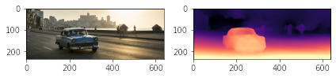

# TER-conti : Monodepth-experiments

This repo is focused around experimenting with monodpeth in python before moving on to a `c++` implementation of the project made by [Tengfei han](https://github.com/TengFeiHan0/monodepth2.cpp)

Here is an example output obtained from monodepth :

